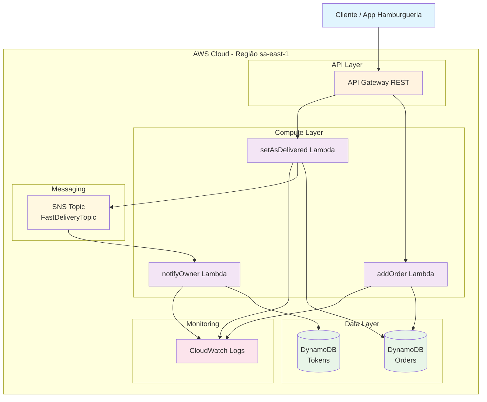
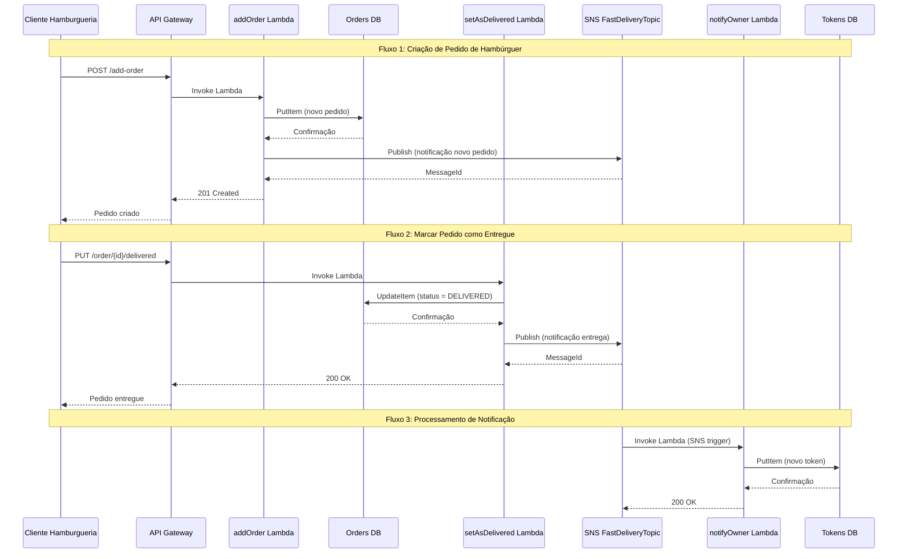
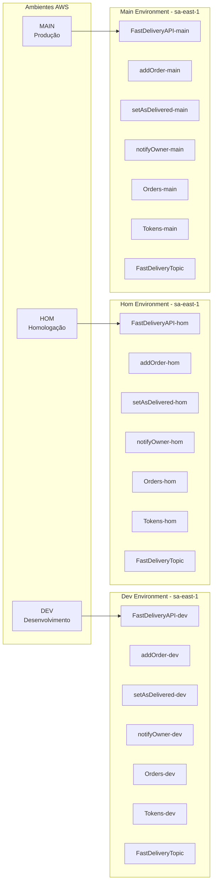
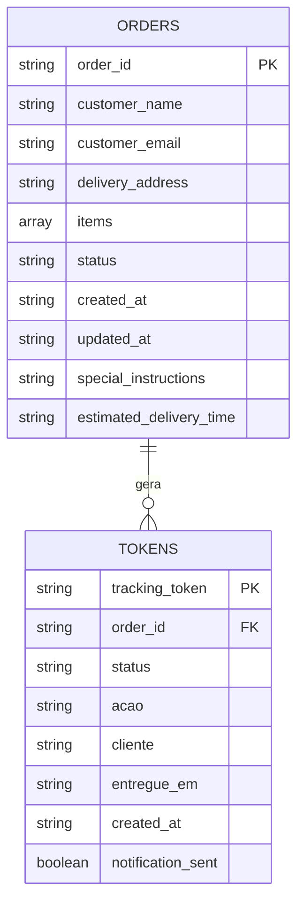
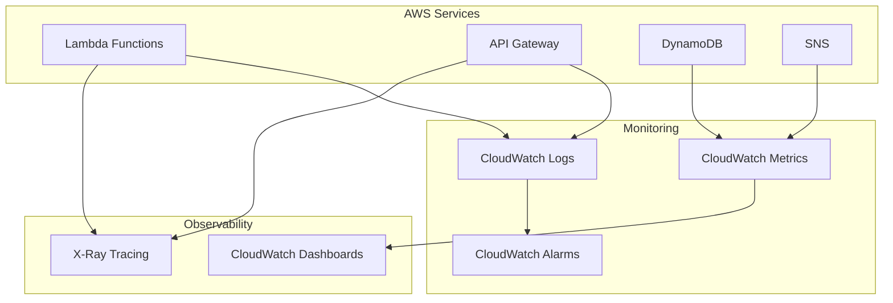
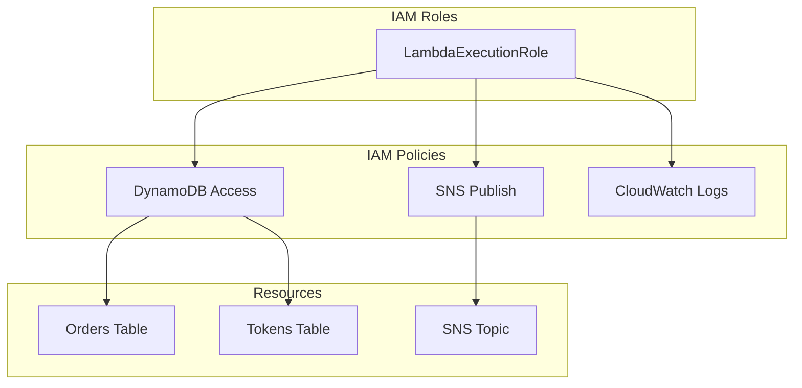
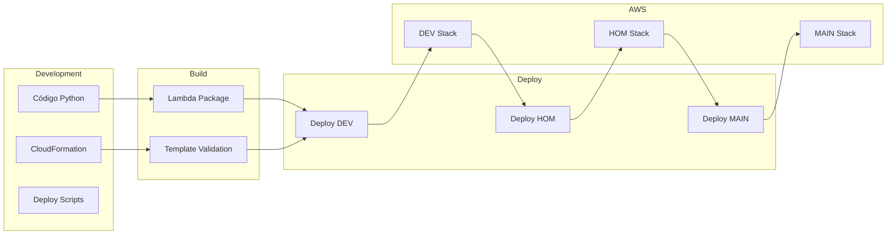

# Diagramas de Arquitetura - FastDelivery Tracker 🍔

## Arquitetura Geral do Sistema (Conforme Requisitos do Professor)

## Fluxo de Dados Detalhado (Sistema de Hamburgueria)

## Arquitetura por Ambiente (sa-east-1)

## Estrutura de Dados (DynamoDB)

### Campos das Tabelas:

**Orders Table:**
- `order_id`: Identificador único do pedido (PK)
- `customer_name`: Nome do cliente
- `customer_email`: Email do cliente
- `delivery_address`: Endereço de entrega
- `items`: Lista de itens do pedido (ex: ["Hambúrguer", "Batata Frita"])
- `status`: Status do pedido (PENDING/DELIVERED)
- `created_at`: Data de criação
- `updated_at`: Data de última atualização
- `special_instructions`: Instruções especiais (opcional)
- `estimated_delivery_time`: Tempo estimado de entrega (opcional)

**Tokens Table:**
- `tracking_token`: Token único de rastreamento (PK)
- `order_id`: Referência ao pedido (FK)
- `status`: Status da notificação
- `acao`: Tipo de ação (novo_pedido/pedido_entregue)
- `cliente`: Nome do cliente
- `entregue_em`: Data/hora da entrega
- `created_at`: Data de criação do token
- `notification_sent`: Se a notificação foi enviada

## Monitoramento e Logs

## Segurança e IAM

## Fluxo de Deploy

